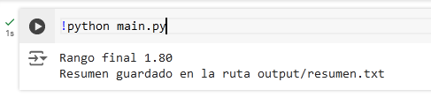

# Resumen de Texto con Python

Se está utilizando el paquete `nltk` para crear un resumen de un texto dado. El programa identifica las oraciones más relevantes en un texto, basándose en la frecuencia de las palabras y crea un resumen con la cantidad de oraciones especificada.

## Se puede usar para distintas tareas como:

* **Resumir artículos de noticias largos:** Para obtener una comprensión rápida del contenido principal de un artículo.
* **Reducir la longitud de documentos académicos:** Para facilitar la lectura y comprensión de textos extensos.
* **Resumir reseñas de productos:** Para obtener una visión general rápida de las opiniones de los usuarios.
* **Resumir correos electrónicos largos:** Para identificar rápidamente la información importante.

## Requisitos:

* Python 3.x
* Paquete `nltk`

## Instalación:

1. Asegúrate de tener Python instalado.
2. Instala el paquete `nltk` ejecutando el siguiente comando en la terminal:

```bash
pip install nltk
```

## Parámetros de configuración en el config.json:

* **`txt_file`:** La ruta del archivo de texto que deseas resumir.
* **`languaje`:** El idioma del texto (por ejemplo, 'english', 'spanish').
* **`init_size`:** El porcentaje inicial del texto original que se utilizará para crear el resumen. 


## Técnicas empleadas

1. **Tokenización:** El texto se divide en palabras y oraciones.

2. **Eliminación de palabras vacías:** Se eliminan palabras que no aportan significado al texto, como "el", "la", "los", etc. 

3. **Cálculo de la frecuencia de las palabras:** Se calcula la frecuencia de aparición de cada palabra en el texto.

4. **Cálculo del valor de cada oración:** Se calcula el valor de cada oración sumando la frecuencia de las palabras que aparecen en esa oración.

5. **Selección de las oraciones con mayor valor:** Se seleccionan las oraciones con el valor más alto para formar el resumen.


## Ejemplo de uso

* Primero configuraremos el config.json

```json
{
	"txt_file":"input/covid19.txt",
	"languaje":"spanish",
	"init_size":1.2
}
```

* Tenemos nuestro archivo txt con el texto original en la ruta `input/covid19.txt`
* Establecemos el lenguaje en español
* Tamaño inicial en 1.2
* Ejecutamos 

```bash
python main.py
```

* Output




* Obtenemos que el rango final es 1.80 (el modelo se a ajustado de forma automática para lograr un texto lo más resumido posible)
* Se guardó en la ruta `output/resumen.txt`

* **El texto original de covid19.txt posee 2479 palabras**
* **El resumen creado posee 557 palabras**